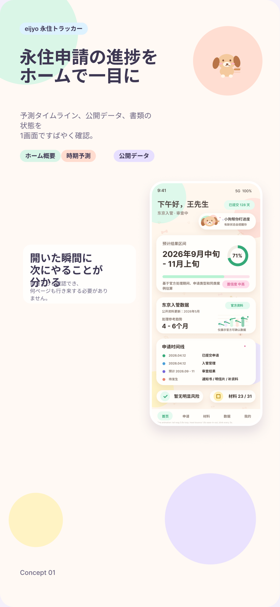
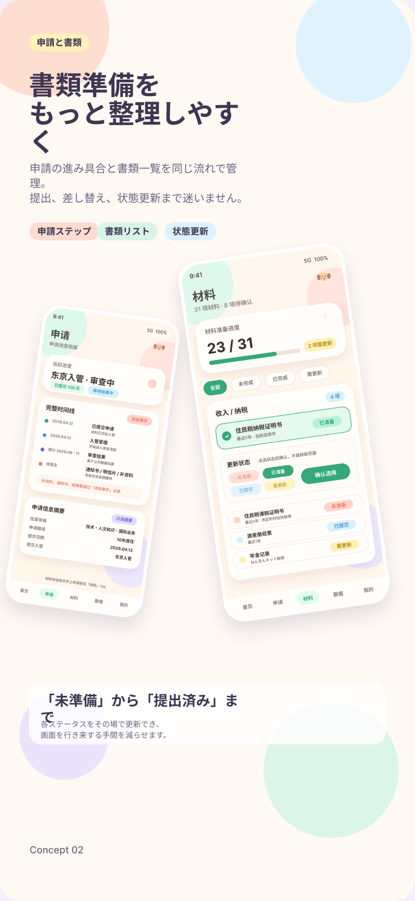
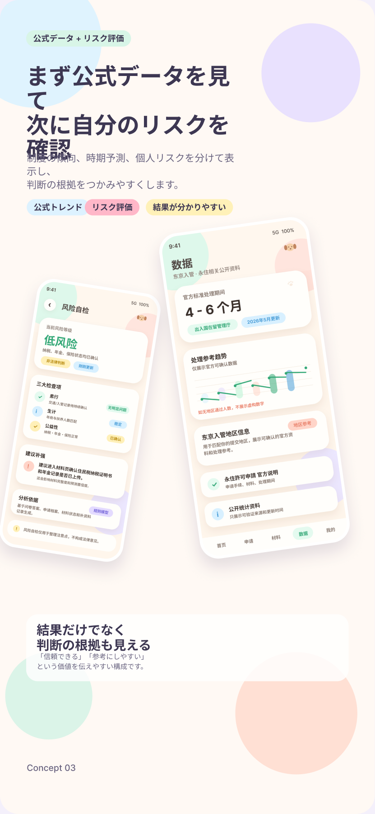

# Eijyo Tracker / 永住トラッカー

Eijyo Tracker は、Kotlin と Jetpack Compose で作成した日本の永住申請管理デモアプリです。


## Preview

<p>
  
  
  
</p>

## デモ動画

エミュレータでの操作デモ（YouTube）：

[](https://www.youtube.com/shorts/TgmaKKPnQ48)

## デザイン

UI デザインは Figma で作成しています：
[Figma — Eijyo Tracker](https://www.figma.com/design/RZlydxagbdXCkVO1A9YOn0/eijyo)

## 概要

永住申請は、書類準備、提出日、入管局、補資料、結果待ち期間など、管理する情報が多くなりがちです。Eijyo Tracker はそれらをひとつの流れにまとめ、現在の状態、次に確認すること、公開データに基づく参考情報を見やすく整理することを目的にしています。

アプリ内では、初回アンケートで申請プロフィールを作成し、ホーム画面で進捗、予測タイムライン、書類状況、リスクセルフチェックを確認できます。公開統計データを使った参考予測も表示しますが、これはあくまで情報整理の補助であり、正確な結果日を保証するものではありません。

## 主な機能

- 初回オンボーディングによる申請プロフィール作成
- ホーム画面での申請ステータス、待機日数、予測期間、書類状況の確認
- 申請タブでの提出日、提出先入管、審査状態、イベント履歴の管理
- 書類タブでの永住申請向けチェックリスト管理
- データタブでの公開統計データと永住許可人数トレンド表示
- FIFO 型の待ち行列モデルを使った参考予測
- プロフィール回答と申請状態に基づくリスクセルフチェック
- 中国語、日本語、英語の UI リソース

## 技術スタック

- Kotlin 2.1
- Android Gradle Plugin 8.7
- Jetpack Compose + Material 3
- Navigation Compose
- Hilt
- Room
- DataStore
- Kotlinx Serialization
- JUnit / AndroidX Test

## ディレクトリ構成

| Path | 内容 |
| --- | --- |
| `app/src/main/java/com/eijyo/tracker` | Android アプリ本体のソースコード |
| `app/src/main/res/values` | 中国語をデフォルト fallback とする文字列リソース |
| `app/src/main/res/values-ja` | 日本語文字列リソース |
| `app/src/main/res/values-en` | 英語文字列リソース |
| `app/src/main/assets` | アプリ内アセット |
| `docs/PREDICTION_AND_DATA.md` | 予測アルゴリズムと公開データ利用方針 |
| `docs/LOCALIZATION.md` | 多言語対応の実装メモ |
| `docs/PRIVACY_POLICY.md` | プライバシーポリシー草案 |
| `docs/media` | README 用の画像、動画、プロモーション素材 |

## ローカル実行

必要な環境:

- Android Studio
- JDK 17
- Android SDK API 35

Debug build:

```sh
./gradlew :app:assembleDebug
```

Test:

```sh
./gradlew test
```

シェルから Java Runtime が見つからない場合は、Android Studio で開くか、`JAVA_HOME` を JDK 17 に設定してください。

## メディア差し替え

README のプロモーション画像は `docs/media/app-store-promo-01.png`、`docs/media/app-store-promo-02.png`、`docs/media/app-store-promo-03.png` を参照しています。

動画を追加する場合は、GitHub の issue、release、PR comment などにアップロードして取得した URL を README に貼る方法が安定します。

## ライセンス

All Rights Reserved. Copyright © 2026 hongyi-wang0108.

本リポジトリはポートフォリオ評価のために公開しています。ソースコードの閲覧のみ許可されます。書面による事前許可なく、使用・複製・改変・再配布・商用利用はできません。詳細は [LICENSE](LICENSE) を参照してください。

## 免責

このアプリはデモプロジェクトです。出入国在留管理庁、e-Stat、その他公的機関とは関係ありません。アプリ内の予測、リスク説明、書類整理の表示は参考情報であり、公式案内、専門家の法的助言、入管への直接確認の代替にはなりません。

## 简体中文

永住 Tracker 是一个用于展示和学习的 Android Demo App，主题是日本永住申请的信息整理。它包含首次问卷、申请档案、材料清单、申请时间线、公开数据和参考性预测。本项目不计划上架，也不提供法律建议或结果保证。

## English

Eijyo Tracker is a portfolio and learning demo Android app for organizing a Japanese permanent residency application journey. It includes onboarding, an application profile, document checklist, timeline, public data views, and reference-only prediction. It is not intended for production release and does not provide legal advice.
